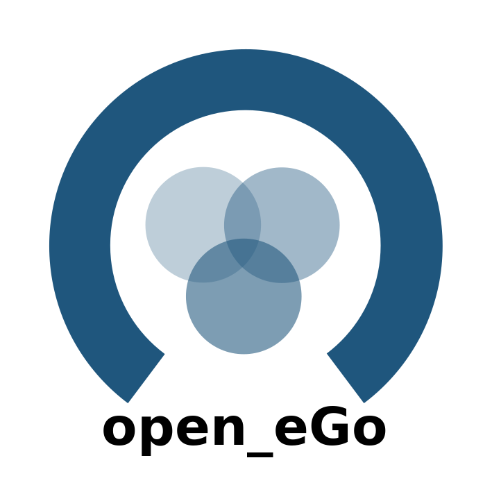

=============================
Welcome to eGo documentation!
=============================

.. note:: Note, the data source of eGo relies on
          the Open Energy Database.  The registration for the public
          accessible API can be found on
          `openenergy-platform.org/login <http://openenergy-platform.org/login/>`_.

Overview
========

.. toctree::
   :maxdepth: 2

   welcome
   installation
   getting_started
   theoretical_background
   developer
   whatsnew
   api

Take also a look into the documentation of
`eTraGo <http://eTraGo.readthedocs.io/>`_ and
`eDisGo <http://edisgo.readthedocs.io/>`_ which are part of eGo.

Indices and tables
==================

* :ref:`genindex`
* :ref:`modindex`
* :ref:`search`

.. raw:: html
   :file: _static/ribbons.html
