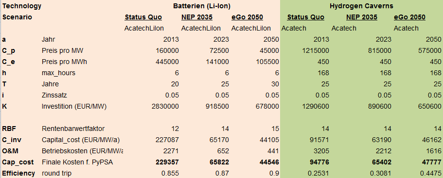

======================
Theoretical background
======================

.. contents::

Models overview
===============

.. figure:: images/open_ego_models_overview.png
   :width: 1123px
   :height: 794px
   :scale: 70%
   :alt: Overview of Models and processes which are used by eGo
   :align: center

eTraGo's theoretical Background
===============================

Learn more about eTraGo's theoretical background of methods and assumptions
`here <https://etrago.readthedocs.io/en/latest/theoretical_background.html>`_.

eDisGo's theoretical Background
===============================

Learn more about eTraGo's theoretical background of methods and assumptions
`here <https://edisgo.readthedocs.io/en/latest/start_page.html>`_.

eDisGo Cluster Method
=====================

In order to achieve acceptable computation times, the problem's complexity can be reduced by applying a k-means cluster-algorithm to MV grids. The algorithm identifies a specified number of representative MV grids and assigns a weighting to each grid. As described `here <https://openego.readthedocs.io/en/dev/api/modules.html#edisgo>`_, the available clustering attributes are:

* cumulative installed **wind capacity**,
* cumulative installed **solar capacity**,
* distance between transition point and **farthest node** of the MV grid
* installed **battery capacity** (as a result of eTraGo's investment optimization)

Subsequent to the MV grid simulations with the reduced number of representative grids, the cluster weighting is used to extrapolate the costs back to the original number of MV grids.

Economic calculation
====================

The tool *eGo* unites the extra high (ehv) and high voltage (hv) models with the 
medium (mv) and low voltage (lv) models to ascertain the costs per selected 
measure and scenario. This results in a cross-grid-level economic result of 
the electrical grid and storage optimisation.

Overnight costs
---------------

The *overnight costs* represents the investment costs of the components or 
construction project without any interest, as if the project was completed 
"overnight". The overnight costs (:math:`C_{\text{Overnight}}` ) of the grid measures
(lines and transformers) are calculated as:

.. math::
        C_{Line~extension}  = S_{Extension}~[MVA] * C_{assumtion}~[\frac{EUR}{MVA}] * L_{Line~length}~[km]    

.. math::
         C_{Transformer~extension}   = S_{Extension}~[MVA] * C_{assumtion}~[\frac{EUR}{MVA}]  

The total overnight grid extension costs are given by:

.. math::
         C_{overnight} = \sum C_{Line~extension} +  \sum C_{Transformer~extension}

The conversion of the given annuity costs of *eTraGo* is done in
:func:`~ego.tools.economics.etrago_convert_overnight_cost`.

Annuity costs
-------------

The *annuity costs* represents project investment costs with an interest as present
value of an annuity. The investment years *T* and the interest rate *p* are 
defined as default in *eGo* with an interest rate ( :math:`p`  ) of ``0.05``
and a number of investment years ( :math:`T` ) of ``40 years``. The values are 
based on the [StromNEV_A1]_ for the grid investment regulation in Germany.

The present value of an annuity (PVA) is calculated as:
            
.. math::
        PVA =  \frac{1}{p}- \frac{1}{\left ( p*\left (1 + p \right )^T \right )}

In order to calculate the :math:`C_{annuity}` of a given period less than a
year the annuity costs are factorized by the hours of the :math:`t_{year}=8760` and the defined calculation period.

.. math::
        t_{period} =  t_{\text{end\_snapshot}} - t_{\text{start\_snapshot}} ~[h]

The annuity costs ( :math:`C_{annuity}` )  is calculated as:

.. math::
        C_{annuity} =   C_{\text{overnight}} * PVA * \left ( \frac{t_{year}}{\left ( t_{\text{period}}+ 1 \right )} \right )

Investment costs ehv/hv
-----------------------

The investment costs of the grid and storage expansion are taken from the studies
[NEP2015a]_ for the extra and high voltage components and the [Dena]_. The 
given costs are transformed in respect to PyPSA *[€/MVA]* format [PyPSA]_ 
components for the optimisation.
    

**Overview of grid cost assumtions:**

The table displays the transformer and line costs which are used for the 
calculation with *eTraGo*.

.. csv-table:: Overview of grid cost assumtions
   :file: files/investment_costs_of_grid_ measures.csv
   :delim: ,
   :header-rows: 1

The *eTraGo* calculation of the annuity costs per simulation period is defined
in :func:`~etrago.tools.utilities.set_line_costs` and 
:func:`~etrago.tools.utilities.set_trafo_costs`. 

**Overview of storage cost assumtions:**

Investment costs mv/lv
----------------------

The tool *eDisGO* is calculating all grid expansion measures as capital or 
*overnight* costs. In order to get the annuity costs of eDisGo's optimisation 
results the function :func:`~ego.tools.economics.edisgo_convert_capital_costs`
is used. The cost assumption of [eDisGo]_ are taken from the [Dena]_ 
and [CONSENTEC]_ study. Based on the component the costs including earthwork
costs can depend on population density according to [Dena]_.

References
==========

.. [NEP2015a] Übertragungsnetzbetreiber Deutschland. (2015).
    *Netzentwicklungsplan Strom 2025 - Kostenschaetzungen*, Version 2015, 
    1. Entwurf, 2015. (`<https://www.netzentwicklungsplan.de/sites/default/files
    /paragraphs-files/kostenschaetzungen_nep_2025_1_entwurf.pdf>`_)

.. [Dena] dena Verteilnetzstudie. (2012).
    *Ausbau- und Innovationsbedarf der Stromverteilnetze in Deutschland bis 2030.*
    , Version 2015. (`<https://shop.dena.de/sortiment/detail/produkt/
    dena-verteilnetzstudie-ausbau-und-innovationsbedarf-der-stromverteilnetze-in-deutschland-bis-2030/>`_)

.. [PyPSA] PyPSA’s documentation (2018).
    *Documentation of components.* , Version v0.11.0. (`<https://pypsa.org/doc/components.html>`_)

.. [StromNEV_A1] Stromnetzentgeltverordnung - StromNEV Anlage 1 (2018).
    *Verordnung über die Entgelte für den Zugang zu Elektrizitätsversorgungsnetzen*
    *(Stromnetzentgeltverordnung - StromNEV) Anlage 1 (zu § 6 Abs. 5 Satz 1)*
    *Betriebsgewöhnliche Nutzungsdauern*.
    (`<https://www.gesetze-im-internet.de/stromnev/anlage_1.html>`_)

.. [Overnight cost] Wikipedia (2018).
    *Definition of overnight cost*. 
    (`<https://en.wikipedia.org/wiki/Overnight_cost>`_)

.. [eDisGo] eDisGo - grid expantion costs (2018).
    *Cost assumption on mv and lv grid components*. 
    (`<https://github.com/openego/eDisGo/blob/dev/edisgo/config/
    config_grid_expansion_default.cfg#L85-L107>`_)

.. [CONSENTEC] CONSENTEC et.al (2006).
    *Untersuchung der Voraussetzungen und möglicher Anwendung analytischer*
    *Kostenmodelle in der deutschen Energiewirtschaft *. 
    (`<https://www.bundesnetzagentur.de/SharedDocs/Downloads/DE/Sachgebiete/
    Energie/Unternehmen_Institutionen/Netzentgelte/Anreizregulierung/
    GA_AnalytischeKostenmodelle.pdf?__blob=publicationFile&v=1>`_)

