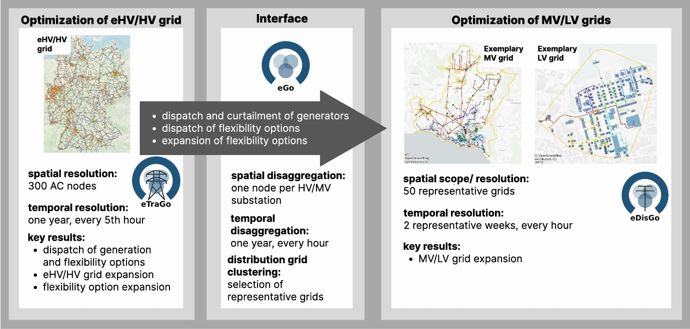

======================
Theoretical background
======================

.. contents::

Model overview
===============

   
   Overview of the cross-grid-level eGo workflow linking eTraGo and eDisGo. Reproduced from [Buettner2025]_, Figure 1; originally published in [Cussmann2024]_ under CC BY-SA.

eTraGo's theoretical Background
===============================

Learn more about eTraGo's theoretical background of methods and assumptions
`here <https://etrago.readthedocs.io/en/latest/theoretical_background.html>`_.

eDisGo's theoretical Background
===============================

Learn more about eDisGo's theoretical background of methods and assumptions
`here <https://edisgo.readthedocs.io/en/latest/start_page.html>`_.

eDisGo Cluster Method
=====================

In order to achieve acceptable computation times, the problem's complexity can be reduced by applying a k-means cluster-algorithm to MV grids. The algorithm identifies a specified number of representative MV grids and assigns a weighting to each grid. As described `here <https://openego.readthedocs.io/en/dev/api/modules.html#edisgo>`_, the available clustering attributes are:

* cumulative installed **wind capacity**,
* cumulative installed **solar capacity**,
* distance between transition point and **farthest node** of the MV grid
* installed **battery capacity** (as a result of eTraGo's investment optimization)

Subsequent to the MV grid simulations with the reduced number of representative grids, the cluster weighting is used to extrapolate the costs back to the original number of MV grids.

Economic calculation
====================

The tool *eGo* unites the extra high (ehv) and high voltage (hv) models with the
medium (mv) and low voltage (lv) models to ascertain the costs per selected
measure and scenario. This results in a cross-grid-level economic result of
the electrical grid and storage optimisation.

Overnight costs
---------------

The *overnight costs* represents the investment costs of the components or
construction project without any interest, as if the project was completed
"overnight". The overnight costs (:math:`C_{\text{Overnight}}` ) of the grid measures
(lines and transformers) are calculated as:

.. math::
        C_{Line~extension}  = S_{Extension}~[MVA] * C_{assumtion}~[\frac{EUR}{MVA}] * L_{Line~length}~[km]

.. math::
         C_{Transformer~extension}   = S_{Extension}~[MVA] * C_{assumtion}~[\frac{EUR}{MVA}]

The total overnight grid extension costs are given by:

.. math::
         C_{overnight} = \sum C_{Line~extension} +  \sum C_{Transformer~extension}

The conversion of the given annuity costs of *eTraGo* is done in
:func:`~ego.tools.economics.etrago_convert_overnight_cost`.

Annuity costs
-------------

The *annuity costs* represents project investment costs with an interest as present
value of an annuity. The investment years *T* and the interest rate *p* are
defined as default in *eGo* with an interest rate ( :math:`p`  ) of ``0.05``
and a number of investment years ( :math:`T` ) of ``40 years``. The values are
based on the [StromNEV_A1]_ for the grid investment regulation in Germany.

The present value of an annuity (PVA) is calculated as:

.. math::
        PVA =  \frac{1}{p}- \frac{1}{\left ( p*\left (1 + p \right )^T \right )}

In order to calculate the :math:`C_{annuity}` of a given period less than a
year the annuity costs are factorized by the hours of the :math:`t_{year}=8760` and the defined calculation period.

.. math::
        t_{period} =  t_{\text{end\_snapshot}} - t_{\text{start\_snapshot}} ~[h]

The annuity costs ( :math:`C_{annuity}` )  is calculated as:

.. math::
        C_{annuity} =   C_{\text{overnight}} * PVA * \left ( \frac{t_{year}}{\left ( t_{\text{period}}+ 1 \right )} \right )

Investment cost modelling
-----------------------

Within the eGo workflow, investment costs are considered through the
underlying optimisation models. Investment decisions for transmission
grid expansion, storage technologies and flexibility options are
optimised at the eHV/HV level using `eTraGo <https://etrago.readthedocs.io/>`_ . The resulting expansion
requirements are subsequently transferred to `eDisGo <https://edisgo.readthedocs.io/>`_ , where the required
expansion of the underlying MV/LV grids is determined. A detailed
description of the optimisation methodology is provided by `Büttner et
al. (2025) <https://doi.org/10.1088/2753-3751/ae2686>`_.

References
==========

.. [StromNEV_A1] Stromnetzentgeltverordnung - StromNEV Anlage 1 (2018).
    *Verordnung über die Entgelte für den Zugang zu Elektrizitätsversorgungsnetzen*
    *(Stromnetzentgeltverordnung - StromNEV) Anlage 1 (zu § 6 Abs. 5 Satz 1)*
    *Betriebsgewöhnliche Nutzungsdauern*.
    (`<https://www.gesetze-im-internet.de/stromnev/anlage_1.html>`_)
    

.. [Overnight cost] Wikipedia (2018).
    *Definition of overnight cost*.
    (`<https://en.wikipedia.org/wiki/Overnight_cost>`_)
.. [Buettner2025]
   Büttner, C., Esterl, K., Schachler, B., and Cußmann, I. (2025).
   Challenges of top-down flexibility deployment for grid expansion
   across all voltage levels. Environmental Research: Energy, 2,
   045017. (`<https://doi.org/10.1088/2753-3751/ae2686>`_)
.. [Cussmann2024]
   Cußmann, I., Schachler, B., Büttner, C., Tetens, H.-P., Esterl, K.,
   Amme, J., Helfenbein, K., Held, M., Nadal, A., Günther, S., and
   Epia Realpe, C. A. (2024). Projektabschlussbericht: Ein offenes
   netzebenen- und sektorenübergreifendes Planungsinstrument zur
   Bestimmung des optimalen Einsatzes und Ausbaus von
   Flexibilitätsoptionen in Deutschland. Technical Report.
   (`<https://ego-n.org/papers/Endbericht_egon_v2.pdf>`_)