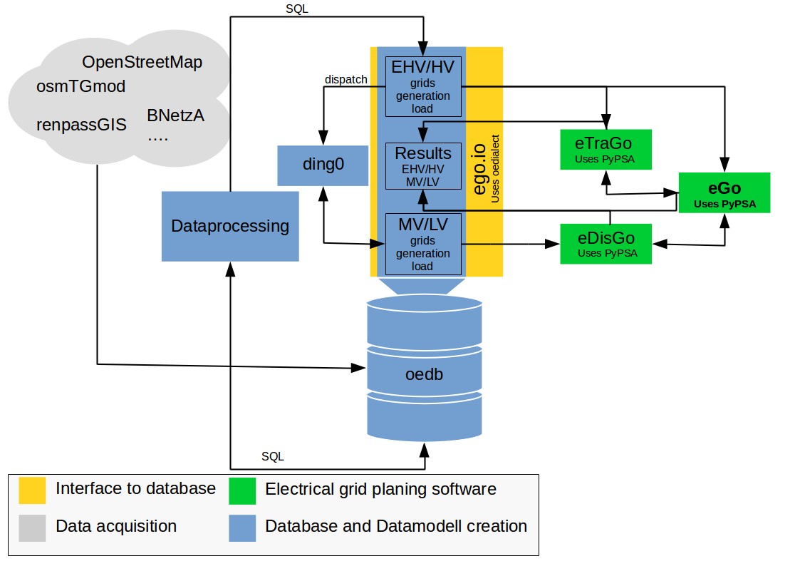

============
The eGo tool
============

The python package eGo is a toolbox and application which connects the tool 
**eTraGo** - with an optimization of flexibility options for transmission grids 
based on PyPSA and **eDisGo** - which analysis and optimization distribution 
grids. 

The open_eGo project
====================
This software project is part of the research project
`open_eGo <https://openegoproject.wordpress.com>`_.

The OpenEnergy Platform
=======================
Within this project we developed the OpenEnergy Platform which this software
is using in order to get and store the in- and output data. Before you start to
calculate a registration on the platform is needed. For more see
`openenergy-platform <https://openenergy-platform.org/>`_ and login.

The OpenEnergy platform mainly addresses students, researchers and scientists in 
the field of energy modelling and analytics as well as interested persons in 
those fields. The platform provides great tools to make your energy system 
modelling process transparent. All data of the open_eGo project are stored at
this platform. 
`Learn more about the database access <https://oep-data-interface.readthedocs.io>`_.

Model overview
==============

eTraGo
------

The python package eTraGo provides an optimization of flexibility options for
transmission grids based on PyPSA. A speciality in this context is that 
transmission grids are described by the 380, 220 and 110 kV in Germany. 
Conventionally the 110kV grid is part of the distribution grid. 
The integration of the transmission and ‘upper’ distribution grid 
is part of eTraGo.

The focus of optimization are flexibility options with a special focus on
energy storages and grid expansion measures.

eDisGo
------
The python package eDisGo provides a toolbox for analysis and optimization
of distribution grids. It is closely related to the python project Ding0 as this
project is currently the single data source for eDisGo providing synthetic
grid data for whole Germany. `Learn more here <http://edisgo.readthedocs.io>`_.

Dataprocessing
--------------

For the open_eGo project several python packages are developed which are feeded 
by the input data of the data processing. The dataprocessing is writen in 
SQL and Python. `Learn more here <https://data-processing.readthedocs.io/>`_.

ego.io
------

The ``ego.io`` is a `SQLAlchemy <https://www.sqlalchemy.org/>`_ Interface to 
the OpenEnergy database (oedb). The oedb tables as ORM objects are defined here 
and small helpers for I/O tasks are contained. 
`Learn more here <https://github.com/openego/ego.io>`_.

Dingo
-----

The DIstribution Network GeneratOr (Ding0) is a tool to generate synthetic 
medium and low voltage power distribution grids based on open 
(or at least accessible) data. 
`Learn more here <https://dingo.readthedocs.io/>`_.

Supported by
============

This project is supported by the German Federal Ministry for Economic 
Affairs and Energy (BMWI).

.. image:: https://i0.wp.com/reiner-lemoine-institut.de/wp-content/uploads/2016/07/BMWi_Logo_Englisch_KLEIN.jpg
   :scale: 90%
   :alt: Supported by BMWi
   :target: http://www.bmwi.de/Navigation/EN/Home/home.html

License
=======

   
© Copyright 2015-2018

Flensburg University of Applied Sciences,
Europa-Universität Flensburg,
Centre for Sustainable Energy Systems

This program is free software: you can redistribute it and/or modify it under
the terms of the GNU Affero General Public License as published by the Free
Software Foundation, either version 3 of the License, or (at your option)
any later version.

This program is distributed in the hope that it will be useful, but WITHOUT
ANY WARRANTY; without even the implied warranty of MERCHANTABILITY or FITNESS
FOR A PARTICULAR PURPOSE. See the GNU Affero General Public License for
more details.

You should have received a copy of the GNU General Public License along
with this program.
If not, see `www.gnu.org/licenses <https://www.gnu.org/licenses/>`_.

Partner
=======

.. image:: https://i0.wp.com/reiner-lemoine-institut.de/wp-content/uploads/2017/03/Logo_ZNES_farbig_NEU.png
   :scale: 90%
   :width: 300px
   :height: 110px
   :alt: ZNES Flensburg
   :target: http://www.znes-flensburg.de/project/150?language=en
   :align: right
   
.. image:: https://i0.wp.com/reiner-lemoine-institut.de/wp-content/uploads/2015/08/RLI_Logo.png
   :scale: 90%
   :width: 180px
   :height: 131px
   :alt: RLI
   :target: http://reiner-lemoine-institut.de/en/open_ego-open-electricity-grid-optimization/
   :align: left

.. image:: https://openegoproject.files.wordpress.com/2017/02/dlr_logo_vernetzte_energiesysteme_gb_grau.jpg?w=301&#038;h=141
   :scale: 90%
   :width: 300px
   :height: 141px
   :alt: DLR
   :target: http://www.dlr.de/ve/en/desktopdefault.aspx/tabid-12472/21440_read-49440/
   :align: right

.. image:: https://i1.wp.com/reiner-lemoine-institut.de/wp-content/uploads/2016/07/Logo_Uni_Magdeburg.png
   :scale: 90%
   :width: 300px
   :height: 103px
   :alt: Uni Magdeburg
   :target: http://iks.cs.ovgu.de/IKS.html
   :align: left

