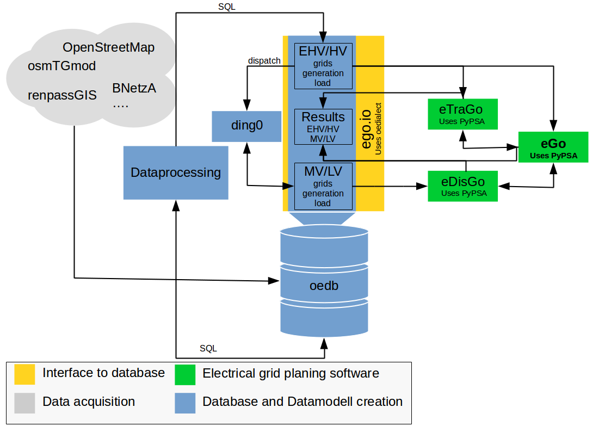

=========
About eGo
=========

What is eGo?
============

eGo (electricity grid optimization) is an open-source Python package for
the cross-grid-level analysis of flexibility deployment and
grid expansion in sector-coupled energy systems. It combines **eTraGo**
and **eDisGo** in a top-down workflow.

eTraGo optimizes generation and flexibility dispatch as well as grid and
storage expansion at the extra-high- and high-voltage levels. Relevant results and operational requirements are transferred to eDisGo,
which analyses the underlying medium- and low-voltage grids and determines
their grid reinforcement needs. eGo links both tools, coordinates the cross-grid-level
workflow, and provides functionality for the joint evaluation of results.

Research context
================

eGo was initially developed in the research project
`open_eGo <https://openegoproject.wordpress.com/>`_ and was further
developed and applied in the research project
`eGon <https://ego-n.org/>`_.

The eGon project extended the modelling framework by a sector-coupled
data model that includes electricity, heat, gas, and mobility as well as
various flexibility options.

The cross-grid-level methodology and its application to a German
2035 scenario are described in
`Büttner et al. (2025) <https://doi.org/10.1088/2753-3751/ae2686>`_.

The Open Energy Platform
========================

The `Open Energy Platform (OEP) <https://openenergy-platform.org/>`_
provides open data and metadata for transparent and reproducible energy
system modelling. Parts of the data used by eGo and related tools in the openego toolchain
are made available through the OEP.

Depending on the selected eGo workflow, access to data hosted on the OEP
or to a local database may be required. Further information on data
access and configuration is provided in the installation and user guide.

Further information about the platform and its data interfaces is
available in the
`Open Energy Platform website <https://openenergy-platform.org/>`_.

Model overview
==============

eTraGo
------

The python package eTraGo provides an optimization of flexibility options for
transmission grids based on PyPSA. In particular transmission grids of different voltage levels
, that is 380, 220 and 110 kV in Germany, can be handled.
Conventionally the 110kV grid is part of the distribution grid.
The integration of the transmission and ‘upper’ distribution grid
is part of eTraGo.

The focus of optimization are flexibility options with a special focus on
energy storages and grid expansion measures.
`Learn more here <http://etrago.readthedocs.io>`_.

eDisGo
------
The python package eDisGo provides a toolbox for analysis and optimization
of distribution grids. It is closely related to the python project Ding0 as this
project is currently the single data source for eDisGo providing synthetic
grid data for whole Germany. `Learn more here <http://edisgo.readthedocs.io>`_.

Dataprocessing
--------------

For the open_eGo project several python packages are developed which are feeded
by the input data of the data processing. The dataprocessing is written in
SQL and Python. `Learn more here <https://data-processing.readthedocs.io/>`_.

ego.io
------

The ``ego.io`` is a `SQLAlchemy <https://www.sqlalchemy.org/>`_ interface to
the OpenEnergy database (oedb). The module provides ORM objects mirroring oedb
tables and additionally contains helper functions for I/O operations.
`Learn more here <https://github.com/openego/ego.io>`_.

Dingo
-----

The DIstribution Network GeneratOr (Ding0) is a tool to generate synthetic
medium and low voltage power distribution grids based on open
(or at least accessible) data.
`Learn more here <https://dingo.readthedocs.io/>`_.

Supported by
============

This project is supported by the German Federal Ministry for Economic
Affairs and Energy (BMWI).

.. image:: https://i0.wp.com/reiner-lemoine-institut.de/wp-content/uploads/2016/07/BMWi_Logo_Englisch_KLEIN.jpg
   :scale: 90%
   :alt: Supported by BMWi
   :target: http://www.bmwi.de/Navigation/EN/Home/home.html

License
=======

.. image:: images/open_ego_icon_web.png
   :scale: 100%
   :align: right

© Copyright 2015-2018

Flensburg University of Applied Sciences,
Europa-Universität Flensburg,
Centre for Sustainable Energy Systems

This program is free software: you can redistribute it and/or modify it under
the terms of the GNU Affero General Public License as published by the Free
Software Foundation, either version 3 of the License, or (at your option)
any later version.

This program is distributed in the hope that it will be useful, but WITHOUT
ANY WARRANTY; without even the implied warranty of MERCHANTABILITY or FITNESS
FOR A PARTICULAR PURPOSE. See the GNU Affero General Public License for
more details.

You should have received a copy of the GNU General Public License along
with this program.
If not, see `www.gnu.org/licenses <https://www.gnu.org/licenses/>`_.

Partner
=======

.. image:: https://i0.wp.com/reiner-lemoine-institut.de/wp-content/uploads/2017/03/Logo_ZNES_farbig_NEU.png
   :scale: 90%
   :width: 300px
   :height: 110px
   :alt: ZNES Flensburg
   :target: http://www.znes-flensburg.de/project/150?language=en
   :align: right

.. image:: https://i0.wp.com/reiner-lemoine-institut.de/wp-content/uploads/2015/08/RLI_Logo.png
   :scale: 90%
   :width: 180px
   :height: 131px
   :alt: RLI
   :target: http://reiner-lemoine-institut.de/en/open_ego-open-electricity-grid-optimization/
   :align: left

.. image:: https://openegoproject.files.wordpress.com/2017/02/dlr_logo_vernetzte_energiesysteme_gb_grau.jpg?w=301&#038;h=141
   :scale: 90%
   :width: 300px
   :height: 141px
   :alt: DLR
   :target: http://www.dlr.de/ve/en/desktopdefault.aspx/tabid-12472/21440_read-49440/
   :align: right

.. image:: https://i1.wp.com/reiner-lemoine-institut.de/wp-content/uploads/2016/07/Logo_Uni_Magdeburg.png
   :scale: 90%
   :width: 300px
   :height: 103px
   :alt: Uni Magdeburg
   :target: http://iks.cs.ovgu.de/IKS.html
   :align: left
