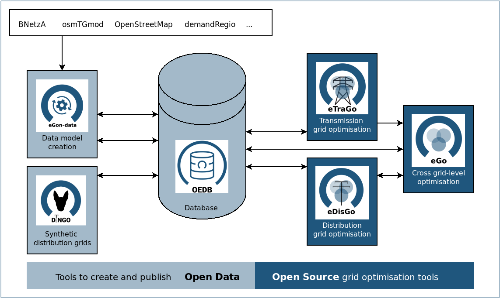

=========
About eGo
=========

What is eGo?
============

eGo (electricity grid optimization) is an open-source Python package for
the cross-grid-level analysis of flexibility deployment and
grid expansion in sector-coupled energy systems. It combines **eTraGo**
and **eDisGo** in a top-down workflow.

eTraGo optimizes generation and flexibility dispatch as well as grid and
storage expansion at the extra-high- and high-voltage levels. Relevant results and operational requirements are transferred to eDisGo,
which analyses the underlying medium- and low-voltage grids and determines
their grid reinforcement needs. eGo links both tools, coordinates the cross-grid-level
workflow, and provides functionality for the joint evaluation of results.

Research context
================

eGo was initially developed in the research project
`open_eGo <https://openegoproject.wordpress.com/>`_ and was further
developed and applied in the research project
`eGon <https://ego-n.org/>`_.

The eGon project extended the modelling framework by a sector-coupled
data model that includes electricity, heat, gas, and mobility as well as
various flexibility options.

The cross-grid-level methodology and its application to a German
2035 scenario are described in
`Büttner et al. (2025) <https://doi.org/10.1088/2753-3751/ae2686>`_.

The Open Energy Platform
========================

The `Open Energy Platform (OEP) <https://openenergy-platform.org/>`_
provides open data and metadata for transparent and reproducible energy
system modelling. Parts of the data used by eGo and related tools in the
openego toolchain are made available through the OEP.

eGo uses the ``ego.io`` package to access data from the Open Energy
Database through the OEP REST API. A registered OEP account is required
for workflows that access the database through this interface.

Depending on the selected workflow, eGo may alternatively use imported
results or locally available data. 
Further information on data access and configuration is provided in the
installation and getting-started sections.

eGo as part of the eGo-Toolchain
==============

   The tools illustrated in the figure above have been developed for cross-grid optimisation of sector-coupled energy systems in Germany as part of the eGo research project. The following sections provide an overview of the individual components and their interactions.

eTraGo
------

`eTraGo <https://etrago.readthedocs.io/>`_ is an open-source Python
package based on PyPSA. It is used to optimize generation and flexibility
dispatch as well as grid and storage expansion at the extra-high- and
high-voltage levels.

Within the eGo workflow, the results of the eTraGo optimization provide
the basis for the subsequent analysis of the underlying medium- and
low-voltage grids.

eGo interface
-------------

eGo links eTraGo and eDisGo in a top-down workflow. It provides the
interface between both tools, prepares and transfers relevant results,
and provides an MV-grid clustering method for selecting representative
distribution grids.

This enables the results and operational requirements from the
upper-grid-level optimization to be considered in the subsequent
distribution-grid analysis.

eDisGo
------

`eDisGo <https://edisgo.readthedocs.io/>`_ is used for the analysis of
medium- and low-voltage grids. Based on the inputs prepared by eGo,
eDisGo analyses representative distribution grids and determines their
grid reinforcement needs.

Related tools and data access
-----------------------------

The eGo workflow is embedded in the wider openego toolchain. Important
related components include:

* `eGon-data <https://github.com/openego/eGon-data>`_ for creating the
  sector-coupled data model,
* `ding0 <https://dingo.readthedocs.io/>`_ for generating synthetic
  medium- and low-voltage grid topologies, and
* `ego.io <https://github.com/openego/ego.io>`_ as the SQLAlchemy-based
  interface used by eGo to access tables of the Open Energy Database
  through the Open Energy Platform.

Supported by
============

This project is supported by the German Federal Ministry for Economic
Affairs and Energy (BMWI).

.. image:: https://i0.wp.com/reiner-lemoine-institut.de/wp-content/uploads/2016/07/BMWi_Logo_Englisch_KLEIN.jpg
   :scale: 90%
   :alt: Supported by BMWi
   :target: http://www.bmwi.de/Navigation/EN/Home/home.html

License
=======

© Copyright 2015-2018

Flensburg University of Applied Sciences,
Europa-Universität Flensburg,
Centre for Sustainable Energy Systems

This program is free software: you can redistribute it and/or modify it under
the terms of the GNU Affero General Public License as published by the Free
Software Foundation, either version 3 of the License, or (at your option)
any later version.

This program is distributed in the hope that it will be useful, but WITHOUT
ANY WARRANTY; without even the implied warranty of MERCHANTABILITY or FITNESS
FOR A PARTICULAR PURPOSE. See the GNU Affero General Public License for
more details.

You should have received a copy of the GNU General Public License along
with this program.
If not, see `www.gnu.org/licenses <https://www.gnu.org/licenses/>`_.

Partner
=======

.. image:: https://i0.wp.com/reiner-lemoine-institut.de/wp-content/uploads/2017/03/Logo_ZNES_farbig_NEU.png
   :scale: 90%
   :width: 300px
   :height: 110px
   :alt: ZNES Flensburg
   :target: http://www.znes-flensburg.de/project/150?language=en
   :align: right

.. image:: https://i0.wp.com/reiner-lemoine-institut.de/wp-content/uploads/2015/08/RLI_Logo.png
   :scale: 90%
   :width: 180px
   :height: 131px
   :alt: RLI
   :target: http://reiner-lemoine-institut.de/en/open_ego-open-electricity-grid-optimization/
   :align: left

.. image:: https://openegoproject.files.wordpress.com/2017/02/dlr_logo_vernetzte_energiesysteme_gb_grau.jpg?w=301&#038;h=141
   :scale: 90%
   :width: 300px
   :height: 141px
   :alt: DLR
   :target: http://www.dlr.de/ve/en/desktopdefault.aspx/tabid-12472/21440_read-49440/
   :align: right

.. image:: https://i1.wp.com/reiner-lemoine-institut.de/wp-content/uploads/2016/07/Logo_Uni_Magdeburg.png
   :scale: 90%
   :width: 300px
   :height: 103px
   :alt: Uni Magdeburg
   :target: http://iks.cs.ovgu.de/IKS.html
   :align: left
